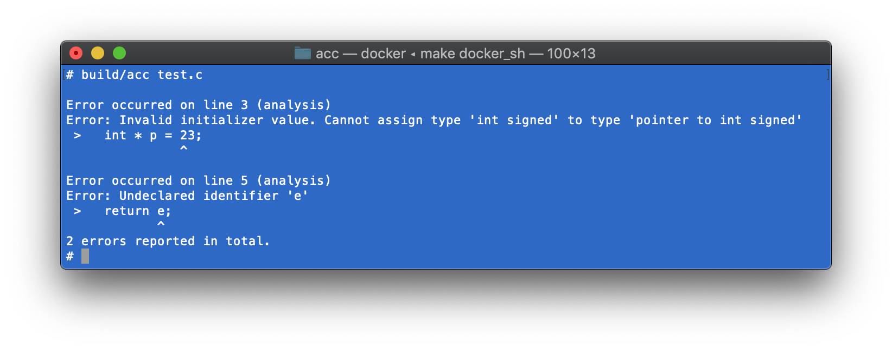
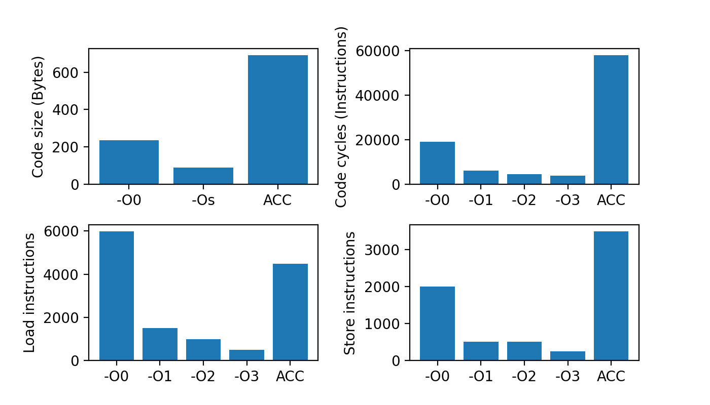

[](https://github.com/alexking35h/acc/actions?query=workflow%3A%22Build+and+Test%22) [](https://github.com/alexking35h/acc/actions?query=workflow%3A%22Regression+Test%22)

# Alex's C Compiler

Welcome! ACC is a C99-subset compiler, written in C. This is a hobby project I started
during the UK's Coronavirus lockdown to brush up on C, and learn more about compilers.

The goals of ACC are:
* Hand-coded everything, including lexer and parser
* Helpful error messages and user interface
* High test coverage



ACC targets ARM Aarch32, and makes no effort to optimise the generated code. ACC is not
designed with extensibility/portability in mind.

## Building

The provided `Dockerfile` includes all the required dependencies for building and testing.

```
Build the Docker container
$ make docker_build

Start the Docker container
$ make docker_sh

Build acc
$ make build/acc

Run unit tests and functional tests
$ make test functional_test
```

## Design

The compiler front-end produces an [Abstract Syntax Tree](include/ast.h) representing input. 

 * [Scanner](include/scanner.h) - Generates a flat sequence of tokens from source input.
 * [Parser](include/parser.h) - Recusrive descent parser generates an AST from the output of the scanner based on C99's grammar.

During [Context-sensitive analysis](include/analysis.h), ACC:
 * Annotates the AST with type information
 * Check for semantic errors
 * Handle type conversions

Seperately, parts of the C language are implemented independently to support compilation:
 * [Types](include/ctype.h) - Handle type-declaration syntax, and dealing with C types.
 * [Symbols](include/symbol.h) - Handle symbol tables used for storing object names, types, and locations.
 * [Pretty-print](include/pretty_print.h) - Generate concise textual representations of ASTs for debugging/testing.

Finally, the back-end handles code generation:
 * A linear [Intermediate Representation](include/ir.h) - close to the target ISA - is generated from the AST,
   with an infinite number of registers.
 * Registers are allocated using the Linear scan algorithm, before generating A32 assembly code.

The assembly generated by ACC should be passed to an assembler (GCC) to build an executable program.

The following snippet should give you an idea of C99's features implemented in ACC:

```c
/* A function */
int func(int a, short b, signed char * c)
{
  *c = a++ * ++b / 2 << 3 + 4;
}
// Another function.
int main()
{
  signed char c_array[10];
  int i = 0, b = 1;
  while(i < 10)
  {
    func(i, b*=2, c_array+i);
    i++;
  }
  return (signed int)c_array[2];
}
```

## Testing

ACC has unit tests - which test components listed above individually, and functional tests - 
which test the compiler end-to-end. Both run on-commit in GitHub.

### Unit Tests

Unit tests use [CMocka](http://https://cmocka.org/) - a C test framework with support for mocking function calls.
The scanner, parser, and analysis tests take C source code as input, and verify expected behaviour, such as 
checking the generated AST, or reported errors. Calling `make test` within the top-level directory runs the unit
tests.

### Functional Tests

Functional tests are written in Python 3 using PyTest, and verify expected program behaviour and
error handling. The tests themselves are parameterized, and run against ACC's IR output (with and without
register allocation), assembly output, and GCC (used as a reference, to verify the tests). Calling 
`make functional_test` within the top-level directory runs the functional tests.

## Benchmarks

Benchmark tests against `GCC` `-Os`, `-O0`, `-O1`,`-O2`,`-O3`; measuring compile size (size of the `.text` ELF section),
runtime (measured in instruction cycles), and number of loads/stores.



## Missing

Generally speaking, I've implemented language features depth-first in the front-end, 
adding support for incremental subsets of the grammar in the parser and type system. Unfortunately,
this means it's missing some (many) features of the C99 grammar. Let's call it C--.

### Scanner

 * `_Bool`, `_Complex`, `_Imaginary` type-specifiers are not implemented.

 * The pre-defined identifier `__func__` is not implemented (added in C99).

### Parser

 * `struct` or `union` are not implemented in the parser.
 
 * No support for `typedef`. 

 * No support for variable length arrays (e.g., `int arr[x]`, where the size of `arr` is unknown at compile-time) 
   \- this was added in C99. In ACC, the array-size declatation syntax is restricted to a scalar constant.
   By contrast, C89 at least permits any scalar constant expression.

 * No support for expression lists, such as `int a = 3+2, 1` (since the _expression_ rule is left-recursive,
   `a` gets the rightmost value in the list: `1`). 

 * No support for floating types (`float`/`double`).

 * Compound assignment operators (`+=`, `-=`, `%=`, `*=`, `/=`, `<<=`, `>>=`, `&=`, `^=`, and `|=`) are desugared
   into simple-assignment syntax. E.g., `a += 2` becomes `a = a + 2`. While this simplifies the AST, this 
   diverges from the standard (6.5.16.2): The lvalue must be evaluated only once.

### Context-sensitive Analysis

  * Type qualifiers (`const`, `volatile` and `volatile`) and storage class specifiers (`register` and
    `static`) are ignored by the compiler.
